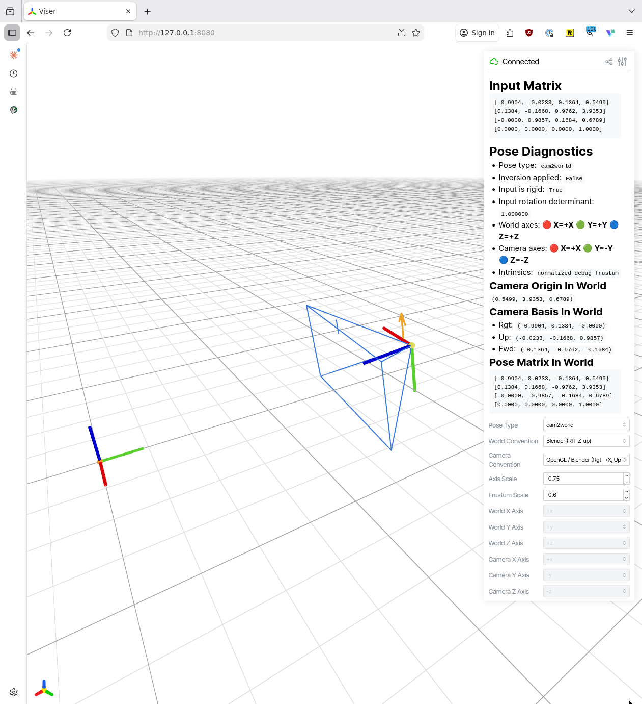

# camviz

Inspect a single camera pose matrix against multiple world and camera coordinate
system conventions, then view the result in a browser-based 3D scene.



## Install

Create or update the environment with `uv`:

```bash
uv sync
```

## Run

Inline matrix:

```bash
uv run camviz inspect \
  --matrix "[[1, 0, 0, 1], [0, 1, 0, 2], [0, 0, 1, 3], [0, 0, 0, 1]]" \
  --pose-type cam2world \
  --camera-convention opencv \
  --world-convention blender
```

Matrix file:

```bash
uv run camviz inspect \
  --matrix pose.json \
  --pose-type world2cam \
  --camera-convention opengl \
  --world-convention maya
```

## Supported presets

World:
- `blender`
- `maya`
- `unity`
- `unreal`
- `robotics`
- `pytorch3d`
- `custom`

Camera:
- `opencv`
- `opengl`
- `pytorch3d`
- `robotics_optical`
- `unity_camera`
- `unreal_camera`
- `custom`

For `custom`, provide axis mappings:

```bash
uv run camviz inspect \
  --matrix pose.txt \
  --pose-type cam2world \
  --camera-convention custom \
  --camera-axes "x=+x,y=-y,z=+z" \
  --world-convention custom \
  --world-axes "x=+x,y=+z,z=-y"
```

Axis strings describe how the source convention's `x`, `y`, and `z` axes map
into the tool's canonical internal frame.

Inline matrices must use explicit Python/JSON list notation. Bare whitespace-
separated numeric strings are rejected on purpose, so it is easy to round-trip
from Python with something like `repr(matrix)` or `json.dumps(matrix)`.

Text-only diagnostics:

```bash
uv run camviz inspect \
  --matrix pose.json \
  --pose-type world2cam \
  --camera-convention opengl \
  --world-convention maya \
  --text-only
```

## Notes

- `viser` is a normal dependency and is installed by default.
- Use `--text-only` when you want diagnostics without launching the viewer.
- Core parsing and transform normalization remain separate from rendering, which
  keeps the inspection logic testable.
